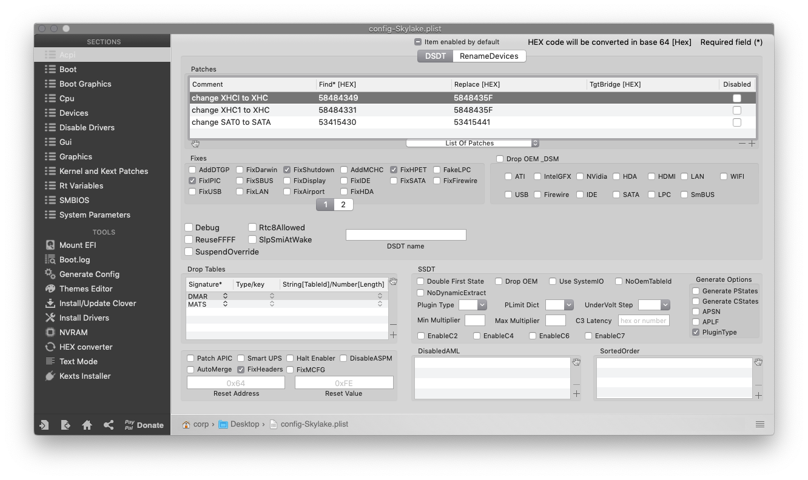
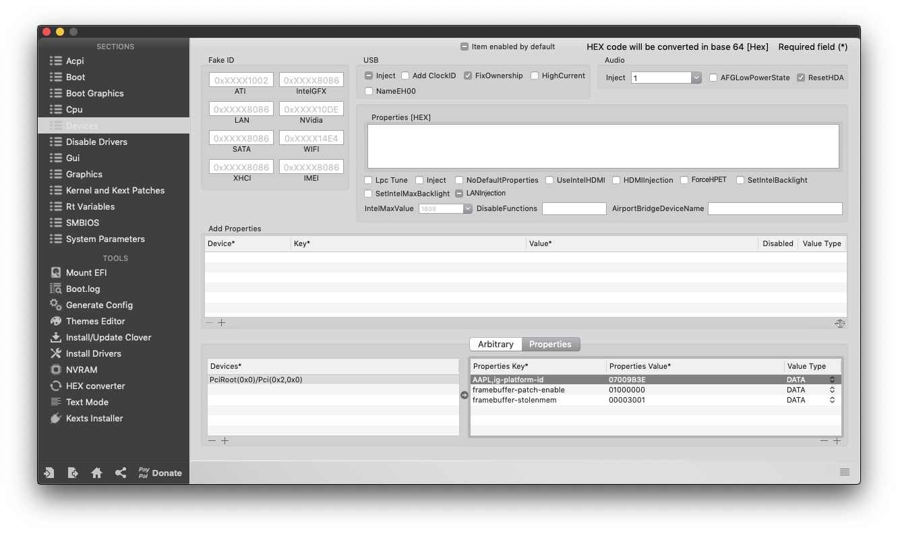
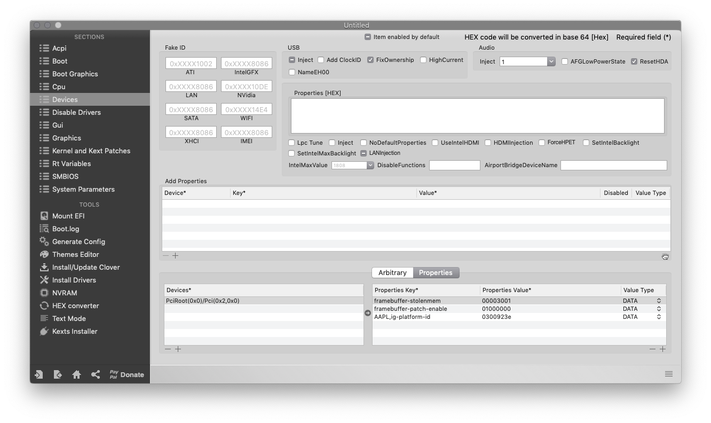
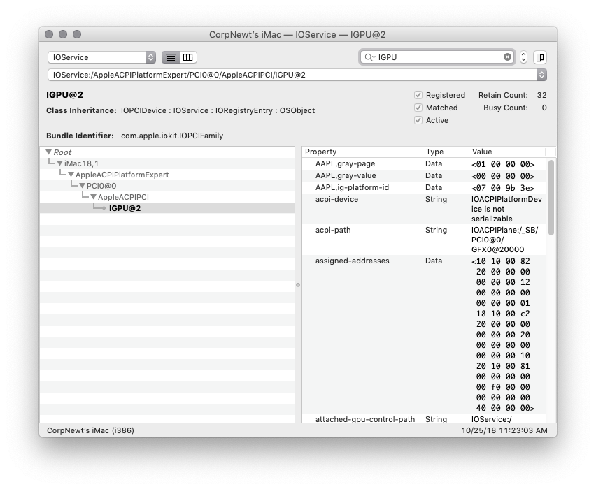
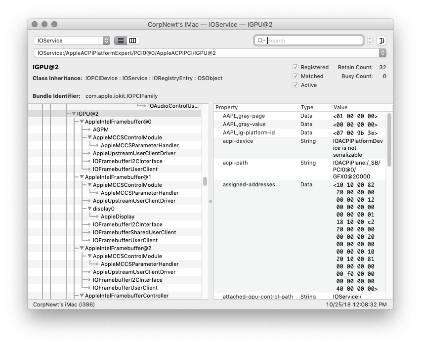
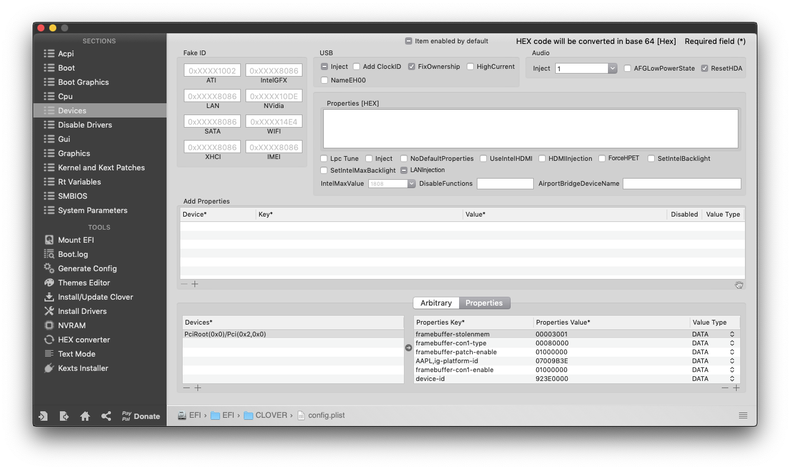
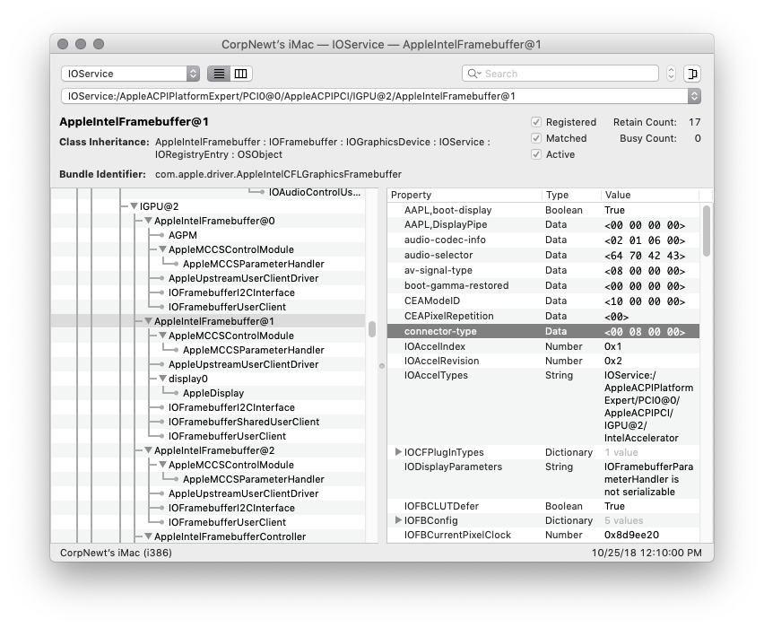
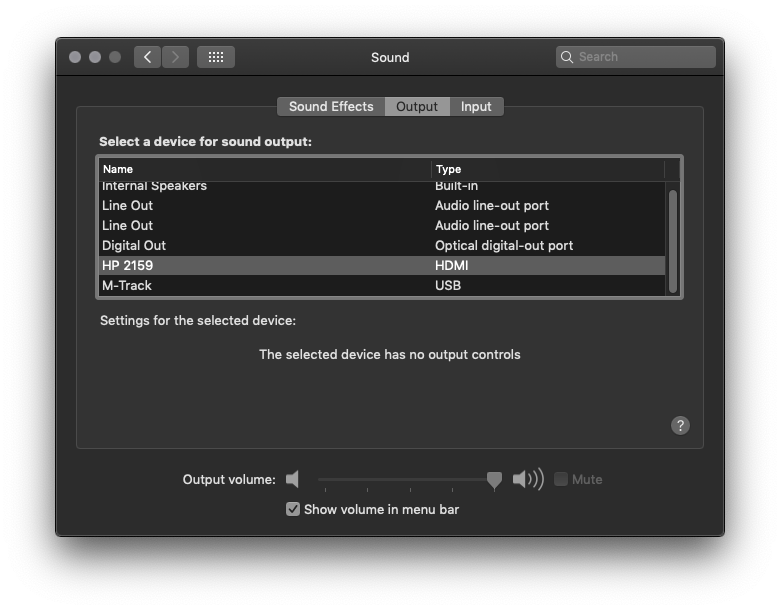
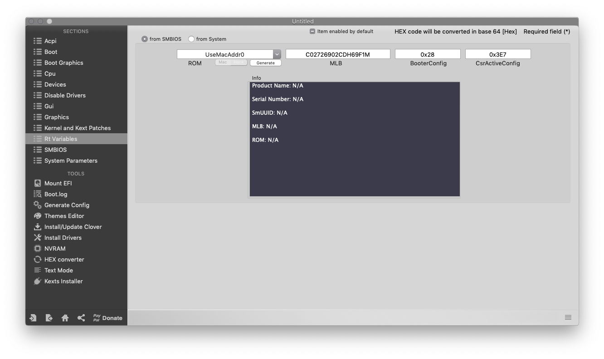
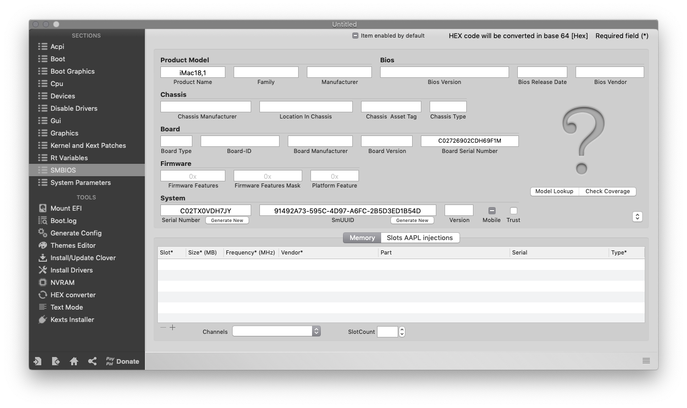

# Coffee Lake

## Starting Points

I like to start with either the stock _config.plist_ that Clover gives you, or with just a blank canvas. In the next examples, I'll show you how I set things up from scratch; if you start from somewhere else, you may have more things checked/set than I do - but you'll want to follow along with what I do.

I'll also include the raw xml examples too in order to show those that work with a text editor \(as I prefer to\).

## ACPI

The default Clover settings are pretty overdone and can cause some issues. We'll keep this section fairly minimal, and I'll go through a bit of _why we do that_ for each part as well.

### Raw XML

```markup
    <key>ACPI</key>
    <dict>
        <key>DSDT</key>
        <dict>
            <key>Fixes</key>
            <dict>
                <key>FixHPET</key>
                <true/>
                <key>FixIPIC</key>
                <true/>
                <key>FixRTC</key>
                <true/>
                <key>FixShutdown</key>
                <true/>
                <key>FixTMR</key>
                <true/>
            </dict>
            <key>Patches</key>
            <array>
                <dict>
                    <key>Comment</key>
                    <string>change XHCI to XHC</string>
                    <key>Disabled</key>
                    <false/>
                    <key>Find</key>
                    <data>
                    WEhDSQ==
                    </data>
                    <key>Replace</key>
                    <data>
                    WEhDXw==
                    </data>
                </dict>
                <dict>
                    <key>Comment</key>
                    <string>change XHC1 to XHC</string>
                    <key>Disabled</key>
                    <false/>
                    <key>Find</key>
                    <data>
                    WEhDMQ==
                    </data>
                    <key>Replace</key>
                    <data>
                    WEhDXw==
                    </data>
                </dict>
                <dict>
                    <key>Comment</key>
                    <string>change SAT0 to SATA</string>
                    <key>Disabled</key>
                    <false/>
                    <key>Find</key>
                    <data>
                    U0FUMA==
                    </data>
                    <key>Replace</key>
                    <data>
                    U0FUQQ==
                    </data>
                </dict>
            </array>
        </dict>
        <key>DropTables</key>
        <array>
            <dict>
                <key>Signature</key>
                <string>DMAR</string>
            </dict>
            <dict>
                <key>Signature</key>
                <string>MATS</string>
            </dict>
        </array>
        <key>FixHeaders</key>
        <true/>
        <key>SSDT</key>
        <dict>
            <key>Generate</key>
            <dict>
                <key>PluginType</key>
                <true/>
            </dict>
        </dict>
    </dict>
```

### Clover Configurator Screenshots




### Explanation

#### Patches:

The first thing we'll go over is the _Patches_ section. This section allows us to dynamically rename parts of the DSDT via Clover. Since we're not running a real mac, and macOS is pretty particular with how things are named, we can make non-destructive changes to keep things mac-friendly. We have three entries here:

* _change XHCI to XHC -_ helps avoid a conflict with built-in USB injectors
* _change XHC1 to XHC_ - helps avoid a conflict with built-in USB injectors
* _change SAT0 to SATA_ - for potential SATA compatibility

#### Fixes:

If we look then at the _Fixes_ section, we'll see that we have a few things checked \(there are 2 pages, so I included 2 screenshots\):

* _FixShutdown_ - this can help with some boards that prefer to restart instead of shutdown.  Sometimes it can cause shutdown issues on other boards \(ironic, right?\), so if you have issues shutting down with this enabled, look at disabling it.
* The remaining fixes help avoid IRQ conflicts and etc, and are not known to cause issues.  They may not be necessary for all hardware, but do not negatively impact anything if applied.

#### Drop Tables:

We touched in gently on DSDT with our _Patches_ section - and this is a a bit of an extension of that. SSDT is like a sub-section of DSDT. The _Drop Tables_ section allows us to omit certain SSDT tables from loading \(as I mentioned before, mac and PC DSDT is different, and macOS can be rather picky\). The two that I've added are as follows:

* _DMAR_ - this prevents some issues with Vt-d; which is PCI passthrough for VMs, and not very functional \(if at all?\) on Hackintoshes.
* _MATS_ - with High Sierra on up this table is parsed, and can sometimes contain unprintable characters that can lead to a kernel panic.

#### FixHeaders and PluginType:

The only other things we've done on this page are enable these two checkboxes.

* _FixHeaders_ - this is just a double-up of our _MATS_ table dropping.  This checkbox tells Clover to sanitize headers to avoid kernel panics related to unprintable characters.
* _PluginType_ - this injects some DSDT data to get _X86PlatformPlugin_ to load - giving us a leg-up on native CPU power management. This setting only works on Haswell and newer CPUs though.

## Boot

We don't need to do _too much_ here, but we'll tweak a few things.

### Raw XML

```markup
    <key>Boot</key>
    <dict>
        <key>Arguments</key>
        <string>keepsyms=1 dart=0 debug=0x100 shikigva=40 -v</string>
        <key>DefaultVolume</key>
        <string>LastBootedVolume</string>
        <key>Timeout</key>
        <integer>5</integer>
    </dict>
```

### Clover Configurator Screenshots


### Explanation

#### Arguments:

We have a few boot args set here:

* `-v` - this enables verbose mode, which shows all the _behind-the-scenes_ text that scrolls by as you're booting instead of the Apple logo and progress bar.  It's invaluable to any Hackintosher, as it gives you an inside look at the boot process, and can help you identify issues, problem kexts, etc.
* `dart=0` - this is just an extra layer of protection against Vt-d issues.
* `debug=0x100` - this prevents a reboot on a kernel panic.  That way you can \(hopefully\) glean some useful info and follow the breadcrumbs to get past the issues.
* `keepsyms=1` - this is a companion setting to `debug=0x100` that tells the OS to also print the symbols on a kernel panic.   That can give some more helpful insight as to what's causing the panic itself.
* `shikigva=40` - this flag is specific to the iGPU.  It enables a few _Shiki_ settings that do the following \(found [_here_](https://github.com/acidanthera/WhateverGreen/blob/master/WhateverGreen/kern_shiki.hpp#L35-L74)\):
  * `8 - AddExecutableWhitelist` - ensures that processes in the whitelist are patched.
  * `32 - ReplaceBoardID` - replaces board-id used by AppleGVA by a different board-id.

#### DefaultBootVolume and Timeout:

These are the only other settings I've updated in this section.

* _DefaultBootVolume_ - this uses NVRAM to remember which volume was last booted by Clover, and auto-select that at the next boot.
* _Timeout_ - this is the number of seconds before the _DefaultBootVolume_ auto-boots.  You can set this to `-1` to avoid all timeout, or to `0` to skip the GUI entirely.  If set to `0`, you can press any keys at boot to get the GUI to show back up in case of issues.

## Boot Graphics

Nothing here - just the stock settings. You could adjust this if Clover's scaling needs changes, but I don't mess with it.

## Cpu

Again, nothing here gets changed in most setups I've worked with.

## Devices

We'll handle some slick property injection for _WhateverGreen_ here, and do some basic audio setup.

### Raw XML

```markup
    <key>Devices</key>
    <dict>
        <key>Audio</key>
        <dict>
            <key>Inject</key>
            <integer>1</integer>
            <key>ResetHDA</key>
            <true/>
        </dict>
        <key>Properties</key>
        <dict>
            <key>PciRoot(0x0)/Pci(0x2,0x0)</key>
            <dict>
                <key>AAPL,ig-platform-id</key>
                <data>
                BwCbPg==
                </data>
                <key>framebuffer-patch-enable</key>
                <data>
                AQAAAA==
                </data>
                <key>framebuffer-stolenmem</key>
                <data>
                AAAwAQ==
                </data>
            </dict>
        </dict>
        <key>USB</key>
        <dict>
            <key>FixOwnership</key>
            <true/>
        </dict>
    </dict>
```

### Clover Configurator Screenshots






### Explanation

#### Fake ID:

This section remains empty for our example setup. In the past, almost-supported iGPUs \(like the HD 4400\) would get faked to a supported iGPU here, but we'll be using the cleaner Properties section for this.

#### USB:

Under this section, we ensure that _Inject_ and _FixOwnership_ are selected to avoid issues with hanging at a half-printed line somewhere around the `Enabling Legacy Matching` verbose line. You can also get past that by enabling _XHCI Hand Off_ in BIOS.

#### Audio:

Here we set our audio to inject _Layout 1_ - this may or may not be compatible with your codec, but you can check on [_AppleALC's Supported Codec Page_](https://github.com/acidanthera/AppleALC/wiki/Supported-codecs).

We also enabled _ResetHDA_ which puts the codec back in a neutral state between OS reboots. This prevents some issues with no audio after booting to another OS and then back.

#### Properties:

This section is setup via Headkaze's [_Intel Framebuffer Patching Guide_](https://www.insanelymac.com/forum/topic/334899-intel-framebuffer-patching-using-whatevergreen/?tab=comments#comment-2626271) and applies only one actual property to begin, which is the _ig-platform-id_. The way we get the proper value for this is to look at the ig-platform-id we intend to use, then swap the pairs of hex bytes.

If we think of our ig-plat as `0xAABBCCDD`, our swapped version would look like `0xDDCCBBAA`.

The two ig-platform-id's we use are as follows:

* `0x3E9B0007` - this is used when the iGPU is used to drive a display
  * `07009B3E` when hex-swapped
  * `BwCbPg==` when the hex-swapped version is converted to base64
* `0x3E920003` - this is used when the iGPU is only used for compute tasks, and doesn't drive a display
  * `0300923E` when hex-swapped
  * `AwCSPg==` when the hex-swapped version is converted to base64

Worth noting that for 10.12 -&gt; 10.13.5, you would need to fake the iGPU to the same values in the Kaby Lake guide, as this was before native Coffee Lake iGPU showed up.

We also add 2 more properties, _framebuffer-patch-enable_ and _framebuffer-stolenmem_. The first enables patching via _WhateverGreen.kext,_ and the second sets the min stolen memory to 19MB.

I added another screenshot as well that shows a `device-id` fake for the i3-8100's UHD 630. This has a different device id than the UHD 630 found on the 8700k, for instance \(`3e918086` vs `3e928086` \).

For this - we follow a similar procedure as our above ig-platform-id hex swapping - but this time, we only work with the first two pairs of hex bytes. If we think of our device id as `0xAABB0000`, our swapped version would look like `0xBBAA0000`. We don't do anything with the last 2 pairs of hex bytes.

The device-id fake is setup like so:

* `0x3e920000` - this is the device id for the UHD 630 found on an 8700k
  * `923e0000` when hex swapped
  * `kj4AAA==` when the hex-swapped version is converted to base64

If using the raw xml, your Properties would look like this \(make sure to still use the appropriate ig-platform-id for your setup\):

```markup
        <key>Properties</key>
        <dict>
            <key>PciRoot(0x0)/Pci(0x2,0x0)</key>
            <dict>
                <key>device-id</key>
                <data>
                kj4AAA==
                </data>
                <key>AAPL,ig-platform-id</key>
                <data>
                BwCbPg==
                </data>
                <key>framebuffer-patch-enable</key>
                <data>
                AQAAAA==
                </data>
                <key>framebuffer-stolenmem</key>
                <data>
                AAAwAQ==
                </data>
            </dict>
        </dict>
```

### Pink/Purple Tint?

I've seen a couple users report a pink tint when using HDMI with the UHD 630 iGPU. I did some experimenting on my own system and was able to work around it a couple different ways.

#### Force RGB

I saw the issue in [a reddit post](https://www.reddit.com/r/hackintosh/comments/9pufo8/8700k_igpu_has_a_purple_tint_on_mojave/), and the solution was to apply a custom override for your display to force it to use RGB instead of YCbCr outlined [here](https://www.mathewinkson.com/2013/03/force-rgb-mode-in-mac-os-x-to-fix-the-picture-quality-of-an-external-monitor). I wrote [a script](https://github.com/corpnewt/ForceRGB) that wraps around this method and auto-applies the override when it's completed. This worked fine for me, but didn't feel like a _real fix_. Which lead me to dive a bit deeper...

#### Connector Types In IOReg

I opened up IORegistryExplorer and in the search bar typed `IGPU` \(this is sometimes named `GFX0` in ACPI, but Lilu + WhateverGreen should rename it properly\) and got the following screen:



Once we've located `IGPU` in IOReg, we can clear our search - this reveals all the info around the `IGPU` section while keeping our place:



As you can see in the above screenshot, I had a few different AppleIntelFramebuffer connections listed. I'm looking for the one that's specifically driving my display - which has the AppleDisplay property. In my case, this was AppleIntelFramebuffer@1. With that selected on the left pane, you can find the `connector-type` property, which was originally set to `<00 04 00 00>` in my case. The connector type can have a few different values:

* `<00 04 00 00>` - this is DisplayPort
* `<00 08 00 00>` - this is HDMI
* `<04 00 00 00>` - this is Digital DVI
* `<02 00 00 00>` - this is LVDS \(for laptops\)
* `<01 00 00 00>` - this is just a Dummy port

What I noticed in my case was that my HDMI port was listed as a DisplayPort - so I was able to use WhateverGreen's patching abilities to change the connector-type.

Since my incorrect port was located at AppleIntelFramebuffer@1, this is port `1`. I needed to enable the port patch in Properties, and then set the connector type to HDMI. I used the following Properties entries for that:

* `framebuffer-conX-enable = 01000000`
* `framebuffer-conX-type = 00080000`

I replaced the `conX` in both patches with `con1` to reflect the port that I am changing, then set the values as listed above.



```markup
        <key>Properties</key>
        <dict>
            <key>PciRoot(0x0)/Pci(0x2,0x0)</key>
            <dict>
                <key>AAPL,ig-platform-id</key>
                <data>
                BwCbPg==
                </data>
                <key>device-id</key>
                <data>
                kj4AAA==
                </data>
                <key>framebuffer-con1-enable</key>
                <data>
                AQAAAA==
                </data>
                <key>framebuffer-con1-type</key>
                <data>
                AAgAAA==
                </data>
                <key>framebuffer-patch-enable</key>
                <data>
                AQAAAA==
                </data>
                <key>framebuffer-stolenmem</key>
                <data>
                AAAwAQ==
                </data>
            </dict>
        </dict>
```



This also enabled HDMI audio for me as well.



## Disable Drivers

We have nothing to do here.

## Gui

### Raw XML

```markup
    <key>GUI</key>
    <dict>
        <key>Scan</key>
        <dict>
            <key>Entries</key>
            <true/>
            <key>Tool</key>
            <true/>
        </dict>
    </dict>
```

### Clover Configurator Screenshots


### Explanation

#### Scan:

The only settings I've tweaked on this page are the _Scan_ settings. I've selected _Custom_, then checked everything except _Legacy_ and _Kernel_. This just omits some of the unbootable entries in Clover to clean up the menu.

#### Hide Volumes:

I haven't added anything here, but you _can_ hide unwanted volumes here. You can do so by either adding the volume's name, or UUID.

To hide extra APFS entries, add the following to this list:

* `Preboot`
* `VM`

To hide all Recovery partitions, add `Recovery` to the list.

To get the UUID of a drive to hide, you can use the following terminal command:

```text
diskutil info diskXsY | grep -i "Partition UUID" | rev | cut -d' ' -f 1 | rev
```

Make sure to replace `diskXsY` with the actual disk number of the volume you'd like to hide.

#### Theme:

If you want to test out a new theme \(and I suggest you look at [_clover-next-black_](https://github.com/al3xtjames/clover-theme-next-black)\), you can add the unzipped theme folder to the _/Volumes/EFI/EFI/CLOVER/themes_ directory, then type the name of the folder in the _Theme_ text field to apply it.

## Graphics

In the past, we'd setup the iGPU here, but since we already did that via Properties in the _Devices_ section, we have nothing to do here.

## Kernel And Kext Patches

### Raw XML

```markup
    <key>KernelAndKextPatches</key>
    <dict>
        <key>KernelPm</key>
        <true/>
        <key>KextsToPatch</key>
        <array>
            <dict>
                <key>Comment</key>
                <string>Port limit increase</string>
                <key>Disabled</key>
                <false/>
                <key>Find</key>
                <data>
                g710////EA==
                </data>
                <key>InfoPlistPatch</key>
                <false/>
                <key>MatchOS</key>
                <string>10.12.x</string>
                <key>Name</key>
                <string>com.apple.driver.usb.AppleUSBXHCI</string>
                <key>Replace</key>
                <data>
                g710////Gw==
                </data>
            </dict>
            <dict>
                <key>Comment</key>
                <string>Port limit increase (RehabMan)</string>
                <key>Disabled</key>
                <false/>
                <key>Find</key>
                <data>
                g32IDw+DpwQAAA==
                </data>
                <key>InfoPlistPatch</key>
                <false/>
                <key>MatchOS</key>
                <string>10.13.x</string>
                <key>Name</key>
                <string>com.apple.driver.usb.AppleUSBXHCI</string>
                <key>Replace</key>
                <data>
                g32ID5CQkJCQkA==
                </data>
            </dict>
            <dict>
                <key>Comment</key>
                <string>Port limit increase (PMHeart)</string>
                <key>Disabled</key>
                <false/>
                <key>Find</key>
                <data>
                g/sPD4MDBQAA
                </data>
                <key>InfoPlistPatch</key>
                <false/>
                <key>MatchOS</key>
                <string>10.14.x</string>
                <key>Name</key>
                <string>com.apple.driver.usb.AppleUSBXHCI</string>
                <key>Replace</key>
                <data>
                g/sPkJCQkJCQ
                </data>
            </dict>
            <dict>
                <key>Comment</key>
                <string>External Icons Patch</string>
                <key>Disabled</key>
                <false/>
                <key>Find</key>
                <data>
                RXh0ZXJuYWw=
                </data>
                <key>InfoPlistPatch</key>
                <false/>
                <key>Name</key>
                <string>AppleAHCIPort</string>
                <key>Replace</key>
                <data>
                SW50ZXJuYWw=
                </data>
            </dict>
        </array>
    </dict>
```

### Clover Configurator Screenshots


### Explanation

In this section, we've enabled a few settings and added some kext patches.

#### Checkboxes:

We have a couple checkboxes selected here:

* _Apple RTC_ - this ensures that we don't have a BIOS reset on reboot.
* _KernelPM_ - this setting prevents writing to MSR 0xe2 which can prevent a kernel panic at boot.

#### KextsToPatch:

We added 4 different kexts to patch here. Three of them are for USB port limit increases, and the last acts as an _orange icons fix_ - when internal drives are hotpluggable, and treated as external drives.

You'll notice that there are MatchOS values set for each of the USB port limit patches. You can remove any of the entries for OS versions you don't intend to run. They won't do any harm being there, but if you want a clean, minimal plist, there's no sense in having them.

## RtVariables And SMBIOS

### Raw XML

```markup
    <key>RtVariables</key>
    <dict>
        <key>BooterConfig</key>
        <string>0x28</string>
        <key>CsrActiveConfig</key>
        <string>0x3E7</string>
        <key>MLB</key>
        <string>C02726902CDH69F1M</string>
        <key>ROM</key>
        <string>UseMacAddr0</string>
    </dict>
    <key>SMBIOS</key>
    <dict>
        <key>BoardSerialNumber</key>
        <string>C02726902CDH69F1M</string>
        <key>ProductName</key>
        <string>iMac18,1</string>
        <key>SerialNumber</key>
        <string>C02TX0VDH7JY</string>
        <key>SmUUID</key>
        <string>91492A73-595C-4D97-A6FC-2B5D3ED1B54D</string>
    </dict>
```

### Clover Configurator Screenshots





### Explanation

For setting up the SMBIOS info, I use acidanthera's [_macserial_](https://github.com/acidanthera/macserial) application. I wrote a [_python script_](https://github.com/corpnewt/Plist-Tool) that can leverage it as well \(and auto-saves to the config.plist when selected\). There's plenty of info that's left blank to allow Clover to fill in the blanks; this means that updating Clover will update the info passed, and not require you to also update your config.plist.

For this Coffee Lake example, I chose the _iMac18,1_ SMBIOS - this is done intentionally for compatibility's sake. There are two main SMBIOS used for Coffee Lake:

* _iMac18,1_ - this is used for computers utilizing the iGPU for displaying.
* _iMac18,3_ - this is used for computers using a dGPU for displaying, and an iGPU for compute tasks only.

To get the SMBIOS info generated with _macserial_, you can run it with the `-a` argument \(which generates serials and board serials for all supported platforms\). You can also parse it with `grep` to limit your search to one SMBIOS type.

With our _iMac18,1_ example, we would run _macserial_ like so via the terminal:

```text
macserial -a | grep -i iMac18,1
```

Which would give us output similar to the following:

```text
      iMac18,1 | C02T8SZNH7JY | C02707101J9H69F1F
      iMac18,1 | C02VXBYDH7JY | C02753100GUH69FCB
      iMac18,1 | C02T7RY6H7JY | C02706310GUH69FA8
      iMac18,1 | C02VD07ZH7JY | C02737301J9H69FCB
      iMac18,1 | C02TQPYPH7JY | C02720802CDH69FAD
      iMac18,1 | C02VXYYVH7JY | C02753207CDH69FJC
      iMac18,1 | C02VDBZ0H7JY | C02737700QXH69FA8
      iMac18,1 | C02VP0H6H7JY | C02746300CDH69FJA
      iMac18,1 | C02VL0W9H7JY | C02743303CDH69F8C
      iMac18,1 | C02V2NYMH7JY | C02728600J9H69FAD
```

The order is `Product | Serial | Board Serial (MLB)`

The `iMac18,1` part gets copied to _SMBIOS -&gt; Product Name_.

The `Serial` part gets copied to _SMBIOS -&gt; Serial Number._

The `Board Serial` part gets copied to _SMBIOS -&gt; Board Serial Number_ as well as _Rt Variables -&gt; MLB._

We can create an SmUUID by running `uuidgen` in the terminal \(or it's auto-generated via my _Plist-Tool_ script\) - and that gets copied to _SMBIOS -&gt; SmUUID_.

We set _Rt Variables -&gt; ROM_ to `UseMacAddr0` which just utilizes our onboard Mac address - this should be unique enough to not conflict with any others.

_BooterConfig_ gets set to `0x28`, and _CsrActiveConfig_ is set to `0x3e7` which effectively disables SIP. You can choose a number of other options to enable/disable sections of SIP. Some common ones are as follows:

* `0x0` - SIP completely enabled
* `0x3` - Allow unsigned kexts and writing to protected fs locations
* `0x3e7` - SIP completely disabled

## System Parameters

### Raw XML

```markup
    <key>SystemParameters</key>
    <dict>
        <key>InjectKexts</key>
        <string>Yes</string>
    </dict>
```

### Clover Configurator Screenshots


### Explanation

#### Inject Kexts:

This setting has 3 modes:

* `Yes` - this tells Clover to inject kexts from the EFI regardless.
* `No` - this tells Clover not to inject kexts from the EFI.
* `Detect` - this has Clover inject kexts only if _FakeSMC.kext_ is not in the kext cache.

We set it to `Yes` to make sure that all the kexts we added before get injected properly.

## Saving

At this point, you can do _File -&gt; Save_ to save the config.plist. If you have issues saving directly to the EFI, you can save it on the Desktop, then just copy it over. I'll leave the [sample config.plist here](https://pastebin.com/XH7Q9XPu) too.

